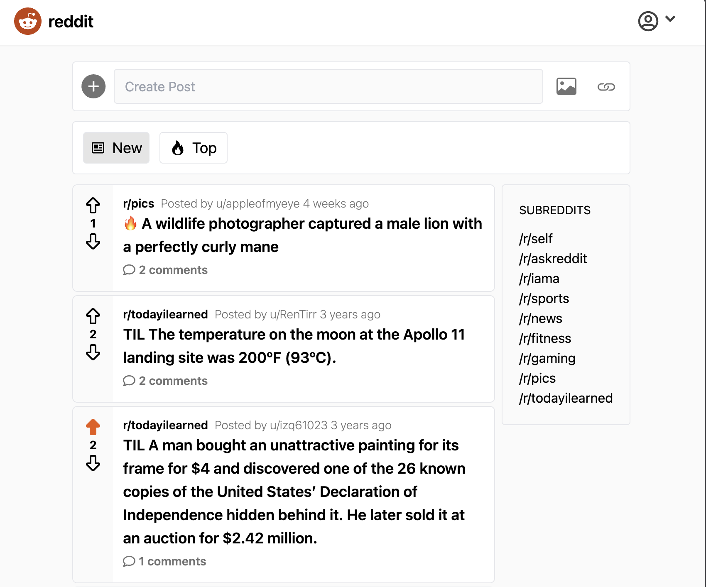

# Reddit Clone

A full-featured Reddit-style social platform with posts, user authentication, and threaded comments.



## 🚀 Live Demo

[View Live Site](https://reddit-clone-next-supabase.vercel.app/)

## ⚡ Features

- User authentication (sign up, login, logout)
- Create and manage posts
- Upvote/downvote system
- Threaded comments with replies
- Responsive mobile-first design

## 🛠️ Built With

- Next.js 16.3.8 (Pages Router, Turbopack)
- React 18.3.1
- TypeScript
- Supabase (PostgreSQL + Auth)
- Tailwind CSS

## 📦 Setup

```bash
npm install
npm run dev
```

The working Supabase baseline is commit `fc8ef58`. The framework migration keeps the existing router, UI and database schema. Supabase Auth migration is a separate next step.

Use the current local Node 24 environment. Copy `.env.example` to `.env.local` and configure your own Supabase project. `supabase/bootstrap-original.sql` has already been applied to the project used during development; do not run it again there.

Validation: `npm run build`, `npm run lint`, `npm test -- --runInBand`, and `npx tsc --noEmit`. Auth helpers and rate limiting are still pending migration/implementation.

## Source layout

```text
src/
  pages/             # Current Pages Router; App Router migration is separate
  components/        # React components: PascalCase files
  constants/         # Shared constants, e.g. ROUTES in routes.ts
  hooks/             # React hooks, e.g. useFormSubmit.ts
  lib/
    format-time-ago.ts
    supabase/
      client.ts
      queries.ts
  styles/
  types/             # Database and application models
public/images/       # Static images, served at /images/...
supabase/            # SQL and backend documentation
__tests__/           # Tests using the same @/ imports as application code
```

`@/` resolves to `src/`. Keep source folders in English: `constants` is a folder; `const` is a JavaScript keyword. Constants use names such as `ROUTES`, components use PascalCase, hooks start with `use`, and utility files use descriptive kebab-case names. Images uploaded by users remain in Supabase Storage.

`npm run update-types` regenerates `src/types/database.ts` from the configured project, using an installed and authenticated Supabase CLI. It preserves the existing file if generation fails.

## 🐳 Docker

```bash
docker build -f docker/Dockerfile -t reddit-clone \
  --build-arg NEXT_PUBLIC_SUPABASE_URL \
  --build-arg NEXT_PUBLIC_SUPABASE_ANON_KEY \
  --build-arg NEXT_PUBLIC_SUPABASE_IMAGE_BUCKET_URL .
docker run -p 3000:3000 reddit-clone
```

Export these public variables before building. The build context remains the repository root; local `.env` files are excluded. Docker build has not yet been validated.

## 🎯 Why I Built This

To demonstrate full-stack capabilities including authentication, database design, real-time features, and modern React patterns.
